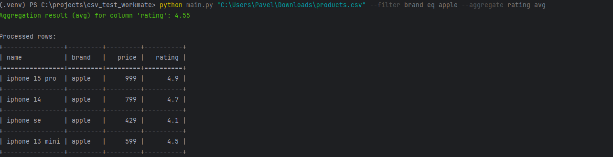
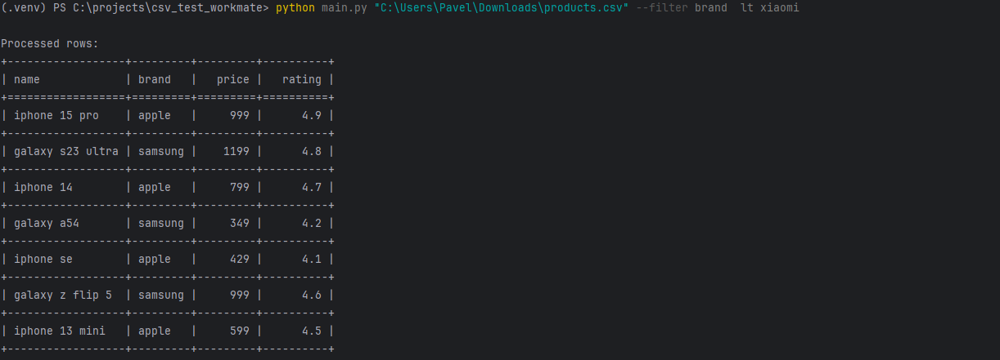
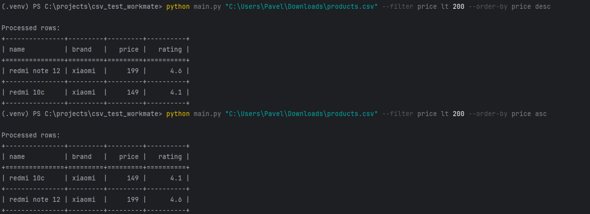

Пример вывода команд
==

filter eq apple + aggregate avg rating. Результат avg выделен зеленым.
---

Фильтрация строкового формата (больше/меньше) осуществляется лексикографически, числа сравниваются по величине
---

asc/desc сортировки с фильтрацией price lt
---
pytest -v пример запуска тестов 